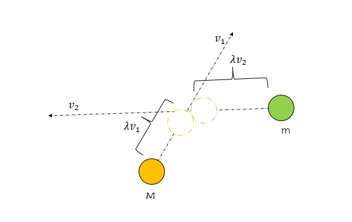
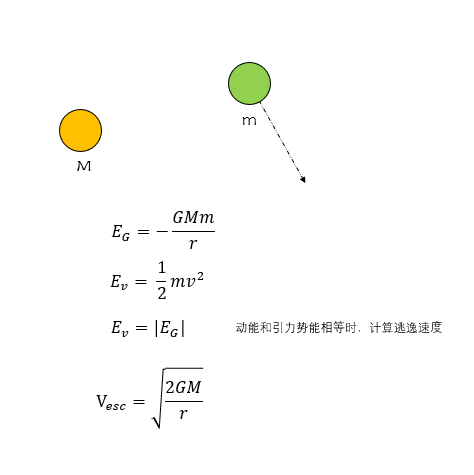
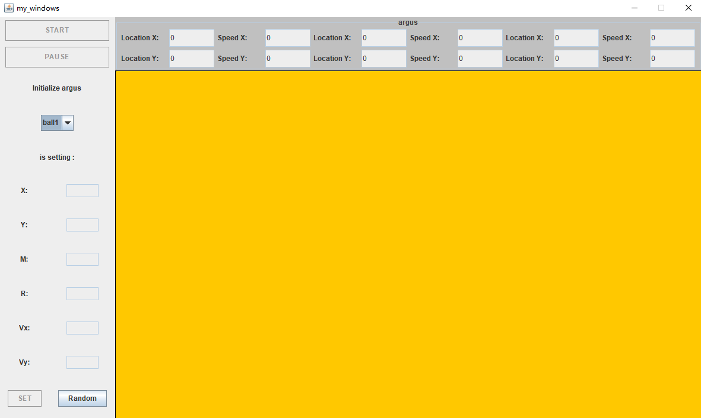
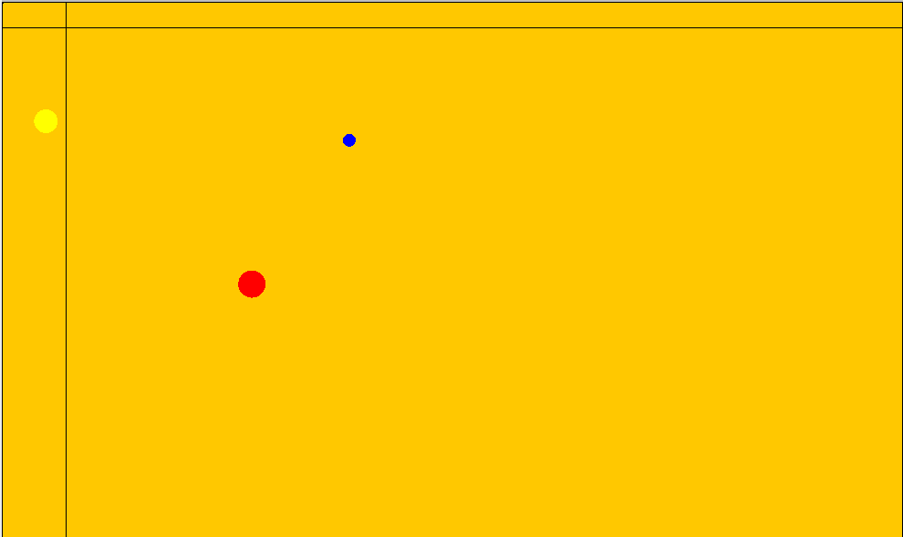
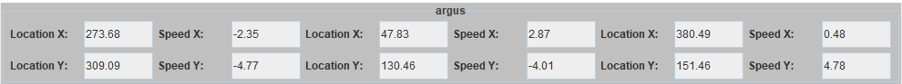
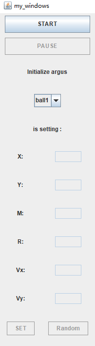

# 这是一个简单模拟二维三体运动的Java程序  
@界面使用swing开发  
@主窗体的宽为1200px，高为720px，可在graph_engine.java中找到Width和Height进行设置  
@窗体主要分为三个部分：位于左侧的附加面板、位于右上的控制参数显示面板和位于右下的主显示面板，这些面板的布局使用GridBagLayout组织起来  
@模拟三体运动提供了随机初始化三个球体位置的功能，用户点击“random”后，系统在第一象限内随机初始化三个距离大于200的位置和方向随机大小不超过2的速度  
@随即设置后，点击“start”开始模拟，点击“pause”停止模拟，重新开始下次模拟  
@位于上部的参数显示面板，提供球体的实时位置和速度的显示功能  
## 二维球体运动过程中会出现碰撞、相互脱离开彼此不再回到原轨迹运行，因此需要处理这两类异常  
碰撞检测：  
  
逃逸速度:  
  
## 主界面  
  
显示与控制界面：  
  
  

